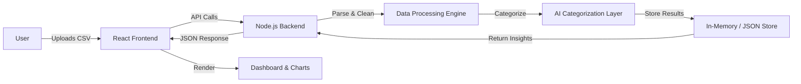
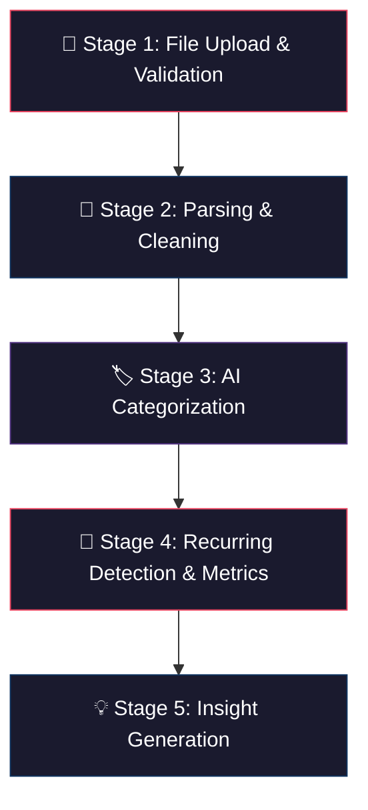
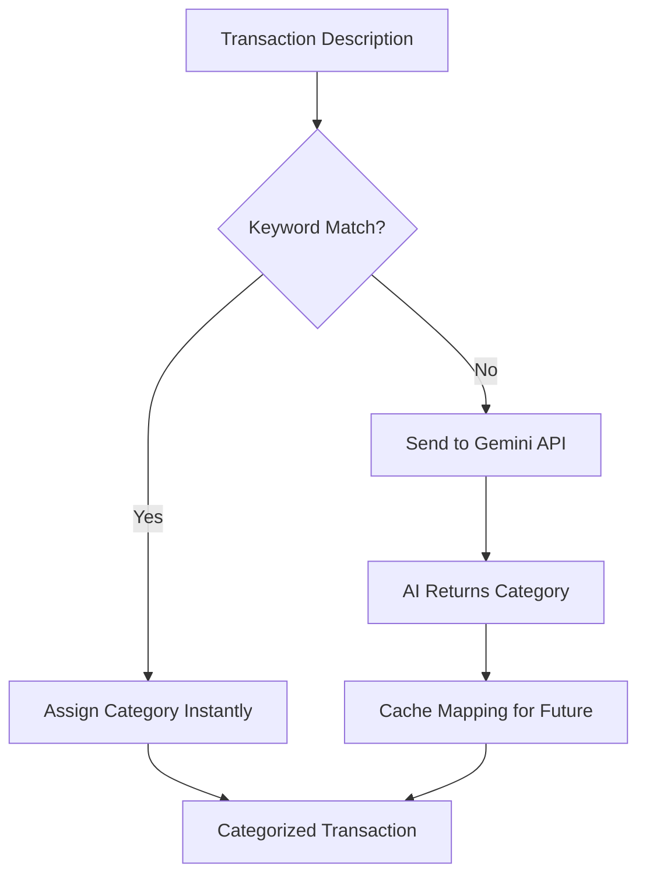
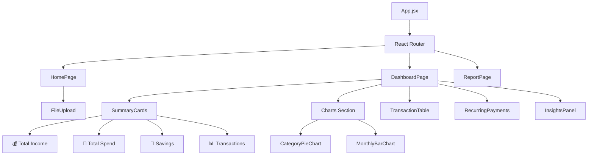
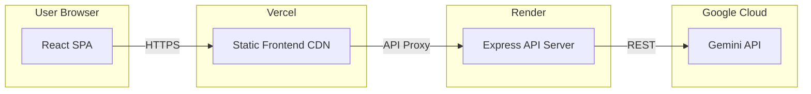

# RupeeRadar — Architecture Document

## 1. System Overview

RupeeRadar is an AI-powered personal finance assistant built as a **full-stack web application**. Users upload bank statement files (CSV), and the system extracts, cleans, categorizes, and analyzes transactions — then presents spending insights through an interactive dashboard.



---

## 2. Technology Stack

| Layer | Technology | Rationale |
|-------|-----------|-----------|
| **Frontend** | React 18 + Vite | Fast dev server, modern tooling, component-based UI |
| **Styling** | Vanilla CSS + CSS Variables | Full control, custom design system, no extra dependencies |
| **Charts** | Chart.js / Recharts | Lightweight, responsive charts for financial data visualization |
| **Backend** | Node.js + Express.js | JavaScript across the stack, simple REST API, fast prototyping |
| **File Parsing** | `csv-parser` / `papaparse` | Robust CSV parsing with error handling |
| **AI Layer** | Google Gemini API | Transaction categorization, insight generation, natural language processing |
| **Data Store** | In-memory + JSON files | No database setup needed — stateless per session, optional persistence |
| **Deployment** | Vercel (Frontend) + Render (Backend) | Free tier, easy setup, auto-deploy from GitHub |

---

## 3. Project Folder Structure

```
RupeeRadar/
├── docs/
│   └── problemStatement.txt        # Original challenge brief
├── context.md                      # Project context summary
├── architecture.md                 # This file
│
├── client/                         # React Frontend (Vite)
│   ├── public/
│   │   └── favicon.ico
│   ├── src/
│   │   ├── assets/                 # Static assets (icons, images)
│   │   ├── components/             # Reusable UI components
│   │   │   ├── FileUpload/
│   │   │   │   ├── FileUpload.jsx
│   │   │   │   └── FileUpload.css
│   │   │   ├── Dashboard/
│   │   │   │   ├── Dashboard.jsx
│   │   │   │   └── Dashboard.css
│   │   │   ├── TransactionTable/
│   │   │   │   ├── TransactionTable.jsx
│   │   │   │   └── TransactionTable.css
│   │   │   ├── Charts/
│   │   │   │   ├── CategoryPieChart.jsx
│   │   │   │   ├── MonthlyBarChart.jsx
│   │   │   │   └── Charts.css
│   │   │   ├── InsightsPanel/
│   │   │   │   ├── InsightsPanel.jsx
│   │   │   │   └── InsightsPanel.css
│   │   │   ├── RecurringPayments/
│   │   │   │   ├── RecurringPayments.jsx
│   │   │   │   └── RecurringPayments.css
│   │   │   └── Summary/
│   │   │       ├── SummaryCards.jsx
│   │   │       └── SummaryCards.css
│   │   ├── pages/
│   │   │   ├── HomePage.jsx        # Landing + upload page
│   │   │   ├── DashboardPage.jsx   # Main analysis dashboard
│   │   │   └── ReportPage.jsx      # Downloadable report view
│   │   ├── services/
│   │   │   └── api.js              # API client (axios/fetch wrappers)
│   │   ├── utils/
│   │   │   ├── formatCurrency.js   # ₹ formatting helpers
│   │   │   └── dateUtils.js        # Date parsing & formatting
│   │   ├── styles/
│   │   │   ├── global.css          # CSS reset, variables, tokens
│   │   │   └── theme.css           # Dark/light mode variables
│   │   ├── App.jsx
│   │   ├── App.css
│   │   └── main.jsx
│   ├── index.html
│   ├── vite.config.js
│   └── package.json
│
├── server/                         # Node.js Backend (Express)
│   ├── src/
│   │   ├── controllers/
│   │   │   ├── uploadController.js     # Handle file uploads
│   │   │   ├── analysisController.js   # Trigger analysis pipeline
│   │   │   └── reportController.js     # Generate downloadable reports
│   │   ├── services/
│   │   │   ├── parserService.js        # CSV parsing & cleaning
│   │   │   ├── categorizationService.js # AI-powered categorization
│   │   │   ├── recurringService.js     # Recurring payment detection
│   │   │   ├── metricsService.js       # Financial metrics calculation
│   │   │   └── insightsService.js      # AI insight generation
│   │   ├── middleware/
│   │   │   ├── errorHandler.js         # Global error handling
│   │   │   └── fileValidator.js        # Upload validation (size, type)
│   │   ├── utils/
│   │   │   ├── categoryMappings.js     # Keyword → category lookup table
│   │   │   └── constants.js            # App-wide constants
│   │   ├── routes/
│   │   │   └── index.js                # Route definitions
│   │   └── app.js                      # Express app setup
│   ├── uploads/                        # Temporary uploaded files (gitignored)
│   ├── .env                            # API keys (gitignored)
│   ├── server.js                       # Entry point
│   └── package.json
│
├── .gitignore
├── README.md
└── package.json                        # Root workspace (optional)
```

---

## 4. Data Flow & Processing Pipeline

The core of RupeeRadar is a **5-stage pipeline** that transforms raw CSV data into actionable insights:



### Stage 1 — File Upload & Validation

| Aspect | Detail |
|--------|--------|
| **Input** | CSV file (bank statement export) |
| **Validation** | File type (`.csv` only), max size (5 MB), non-empty |
| **Storage** | Temporary — stored in `server/uploads/`, deleted after processing |
| **Error Handling** | Return 400 with descriptive error if validation fails |

### Stage 2 — Parsing & Cleaning

```
Raw CSV Row:
"15/05/2026","UPI/SWIGGY/435267890/Payment","","-₹457.00","₹12,543.00"

Cleaned Transaction Object:
{
  "date": "2026-05-15",
  "description": "UPI SWIGGY 435267890 Payment",
  "type": "debit",
  "amount": 457.00,
  "balance": 12543.00,
  "rawDescription": "UPI/SWIGGY/435267890/Payment"
}
```

**Cleaning Steps:**
1. Parse CSV rows into structured objects
2. Normalize date formats → `YYYY-MM-DD`
3. Strip currency symbols, commas → parse as float
4. Classify as `credit` or `debit` based on amount sign / column
5. Clean description — remove special chars, normalize whitespace
6. Handle edge cases: empty rows, malformed data, missing fields

### Stage 3 — AI Categorization

**Hybrid Approach** — Combines keyword matching with AI fallback:



#### Keyword Mapping Table (Fast Path)

| Keyword Pattern | Category |
|----------------|----------|
| `swiggy`, `zomato`, `restaurant`, `food`, `grocery`, `bigbasket`, `blinkit` | Food |
| `uber`, `ola`, `irctc`, `makemytrip`, `fuel`, `petrol`, `metro` | Travel |
| `amazon`, `flipkart`, `myntra`, `ajio`, `mall`, `retail` | Shopping |
| `electricity`, `airtel`, `jio`, `vodafone`, `broadband`, `water` | Bills |
| `emi`, `loan`, `hdfc loan`, `bajaj finserv` | EMI |
| `netflix`, `spotify`, `hotstar`, `youtube`, `prime`, `gym` | Subscriptions |
| `salary`, `payroll`, `stipend` | Salary |
| `rent`, `house rent`, `landlord` | Rent |
| `mutual fund`, `sip`, `zerodha`, `groww`, `fd`, `ppf` | Investments |

> Transactions that don't match any keyword are batched and sent to the **Gemini API** for intelligent categorization.

#### Gemini API Prompt Template

```
You are a financial transaction categorizer for Indian bank statements.

Categorize each transaction into EXACTLY ONE of these categories:
Food, Travel, Shopping, Bills, EMI, Subscriptions, Salary, Rent, Investments, Other

Transactions:
1. "UPI/RAJESH KUMAR/9876543210" — ₹15,000
2. "NEFT/ACME CORP/SALARY/JUN" — ₹85,000
3. "POS/DECATHLON SPORTS" — ₹3,200

Respond as JSON array:
[{"index": 1, "category": "...", "confidence": 0.9}, ...]
```

### Stage 4 — Recurring Detection

**Algorithm:** Group transactions by normalized description → check frequency:

```
1. Normalize descriptions (lowercase, strip numbers/dates)
2. Group by normalized key
3. For each group:
   - Count occurrences
   - Check date intervals (monthly ≈ 28-31 days)
   - If count >= 2 AND interval is regular → mark as RECURRING
4. Classify recurring type: "Subscription", "EMI", "Rent", "SIP", "Insurance"
```

**Detection Criteria:**

| Pattern | Classification |
|---------|---------------|
| Same payee, monthly interval, same amount | EMI / Subscription |
| Same payee, monthly interval, varying amount | Utility Bill |
| Same payee, quarterly/annual interval | Insurance / Annual Subscription |

### Stage 5 — Insight Generation

Financial metrics are calculated, then fed to Gemini for natural language insights:

**Calculated Metrics:**

```javascript
{
  totalIncome: 125000.00,
  totalSpend: 87500.00,
  netSavings: 37500.00,
  savingsRate: 30.0,                    // percentage
  topCategories: [
    { name: "Food", amount: 18500, percentage: 21.1 },
    { name: "Rent", amount: 15000, percentage: 17.1 },
    { name: "Shopping", amount: 12300, percentage: 14.1 }
  ],
  biggestTransaction: {
    description: "RENT TRANSFER",
    amount: 15000,
    date: "2026-05-01"
  },
  recurringTotal: 35000.00,
  transactionCount: 147,
  avgDailySpend: 2916.67,
  categoryBreakdown: { ... }
}
```

**AI Insight Prompt:**

```
Based on this financial data, generate 5 personalized, actionable insights.
Use actual amounts in ₹. Be specific, not generic.
Tone: friendly financial advisor. Keep each insight to 1-2 sentences.

Data: {metrics JSON}

Example insight format:
"🍕 Your food spending of ₹18,500 makes up 21% of total expenses.
Consider meal prepping to cut this by ₹5,000/month."
```

---

## 5. API Design

### Endpoints

| Method | Endpoint | Description | Request | Response |
|--------|----------|-------------|---------|----------|
| `POST` | `/api/upload` | Upload bank statement CSV | `multipart/form-data` (file) | `{ fileId, rowCount, status }` |
| `POST` | `/api/analyze` | Run full analysis pipeline | `{ fileId }` | `{ transactions, metrics, insights, recurring }` |
| `GET` | `/api/report/:fileId` | Get analysis results | — | Full analysis JSON |
| `GET` | `/api/report/:fileId/download` | Download PDF/CSV report | — | File download |
| `GET` | `/api/health` | Server health check | — | `{ status: "ok" }` |

### Response Schema — `/api/analyze`

```json
{
  "success": true,
  "data": {
    "summary": {
      "totalIncome": 125000.00,
      "totalSpend": 87500.00,
      "netSavings": 37500.00,
      "savingsRate": 30.0,
      "transactionCount": 147,
      "dateRange": {
        "from": "2026-05-01",
        "to": "2026-05-31"
      }
    },
    "categoryBreakdown": [
      {
        "category": "Food",
        "totalAmount": 18500.00,
        "percentage": 21.1,
        "transactionCount": 42
      }
    ],
    "topTransactions": [
      {
        "date": "2026-05-01",
        "description": "RENT TRANSFER",
        "amount": 15000.00,
        "category": "Rent"
      }
    ],
    "recurringPayments": [
      {
        "description": "NETFLIX SUBSCRIPTION",
        "amount": 649.00,
        "frequency": "monthly",
        "category": "Subscriptions",
        "occurrences": 3
      }
    ],
    "insights": [
      {
        "id": 1,
        "emoji": "🍕",
        "title": "Food Spending Alert",
        "text": "You spent ₹18,500 on food this month...",
        "type": "warning"
      }
    ],
    "transactions": [
      {
        "id": "txn_001",
        "date": "2026-05-15",
        "description": "UPI SWIGGY Payment",
        "amount": 457.00,
        "type": "debit",
        "category": "Food",
        "isRecurring": false
      }
    ]
  }
}
```

---

## 6. Frontend Architecture

### Component Tree



### Key Components

| Component | Responsibility |
|-----------|---------------|
| **FileUpload** | Drag-and-drop CSV upload with progress indicator, file validation |
| **SummaryCards** | 4 metric cards — Total Income, Total Spend, Net Savings, Transaction Count |
| **CategoryPieChart** | Pie/donut chart showing spend distribution by category |
| **MonthlyBarChart** | Bar chart showing daily or weekly spending trends |
| **TransactionTable** | Sortable, filterable table of all transactions with category badges |
| **RecurringPayments** | List of detected recurring payments with frequency and amounts |
| **InsightsPanel** | AI-generated spending insights displayed as cards with emoji icons |
| **ReportPage** | Print-friendly view with download as PDF option |

### State Management

```
No external state library needed — React's built-in state is sufficient:

• useState — component-level state (form inputs, UI toggles)
• useContext — shared analysis data across dashboard components
• Custom hook: useAnalysis() — wraps API calls, loading/error states
```

### Routing

| Route | Page | Description |
|-------|------|-------------|
| `/` | HomePage | Landing page with file upload |
| `/dashboard` | DashboardPage | Main analysis view (after upload) |
| `/report` | ReportPage | Printable/downloadable report |

---

## 7. Design System

### Color Palette

```css
:root {
  /* Primary */
  --color-primary: #6C5CE7;        /* Purple — brand identity */
  --color-primary-light: #A29BFE;
  --color-primary-dark: #4834D4;

  /* Semantic */
  --color-income: #00B894;          /* Green — money in */
  --color-expense: #E17055;         /* Coral — money out */
  --color-savings: #0984E3;         /* Blue — savings */
  --color-warning: #FDCB6E;         /* Yellow — alerts */

  /* Neutrals */
  --color-bg: #0F0F1A;             /* Dark background */
  --color-surface: #1A1A2E;        /* Card surfaces */
  --color-surface-hover: #222240;
  --color-text: #E8E8F0;           /* Primary text */
  --color-text-muted: #8888A0;     /* Secondary text */
  --color-border: #2A2A45;         /* Subtle borders */

  /* Category Colors */
  --cat-food: #FF6B6B;
  --cat-travel: #4ECDC4;
  --cat-shopping: #FFE66D;
  --cat-bills: #A8E6CF;
  --cat-emi: #FF8A5C;
  --cat-subscriptions: #6C5CE7;
  --cat-salary: #00B894;
  --cat-rent: #E17055;
  --cat-investments: #0984E3;
  --cat-other: #636E72;
}
```

### Typography

```css
/* Google Fonts: Inter (body) + Space Grotesk (headings) */
--font-body: 'Inter', system-ui, sans-serif;
--font-heading: 'Space Grotesk', 'Inter', sans-serif;
--font-mono: 'JetBrains Mono', monospace;

/* Scale */
--text-xs: 0.75rem;    /* 12px */
--text-sm: 0.875rem;   /* 14px */
--text-base: 1rem;     /* 16px */
--text-lg: 1.125rem;   /* 18px */
--text-xl: 1.25rem;    /* 20px */
--text-2xl: 1.5rem;    /* 24px */
--text-3xl: 2rem;      /* 32px */
--text-4xl: 2.5rem;    /* 40px */
```

### Visual Style

- **Dark mode first** — sleek, finance-app aesthetic
- **Glassmorphism cards** — `backdrop-filter: blur()` with subtle transparency
- **Smooth transitions** — 200-300ms ease for hover/state changes
- **Gradient accents** — purple-to-blue gradients for headers and CTAs
- **Category color-coding** — each expense category has a unique color throughout the UI

---

## 8. Security & Privacy

| Concern | Approach |
|---------|----------|
| **File Storage** | Uploaded files are stored temporarily and deleted after processing (never persisted) |
| **No User Accounts** | No authentication — fully anonymous, stateless usage |
| **API Keys** | Gemini API key stored in `.env`, never exposed to frontend |
| **Data Transmission** | HTTPS in production; no financial data logged on server |
| **Client-Side Option** | Future enhancement — option to run categorization entirely in-browser |
| **File Validation** | Strict CSV-only validation, max 5MB, sanitized inputs |

---

## 9. Error Handling Strategy

| Scenario | Handling |
|----------|---------|
| Invalid file type | Frontend validation + 400 response with message |
| Empty/corrupt CSV | Parser catches errors → return partial results + warnings |
| Gemini API failure | Fallback to keyword-only categorization (graceful degradation) |
| Gemini API rate limit | Queue and retry with exponential backoff |
| Network error | Frontend shows retry button with cached upload state |
| Unrecognized transaction | Categorize as "Other" — never fail silently |

---

## 10. Performance Considerations

| Area | Strategy |
|------|----------|
| **CSV Parsing** | Stream-based parsing for large files (don't load entire file into memory) |
| **AI Batching** | Batch uncategorized transactions into groups of 20 for single API calls |
| **Caching** | Cache keyword → category mappings; cache AI responses for identical descriptions |
| **Frontend** | Virtualized table rendering for 500+ transactions; lazy-load chart libraries |
| **Response Size** | Paginate transaction list; send summary separately from full transaction array |

---

## 11. Deployment Architecture



| Component | Platform | URL Pattern |
|-----------|----------|-------------|
| Frontend | Vercel | `rupeeradar.vercel.app` |
| Backend API | Render | `rupeeradar-api.onrender.com` |
| AI Service | Google Cloud | `generativelanguage.googleapis.com` |

---

## 12. Development Workflow

### Setup Commands

```bash
# Clone and install
git clone <repo-url>
cd RupeeRadar

# Frontend
cd client
npm install
npm run dev          # → http://localhost:5173

# Backend (separate terminal)
cd server
npm install
npm run dev          # → http://localhost:3000
```

### Environment Variables

```env
# server/.env
PORT=3000
GEMINI_API_KEY=your_gemini_api_key_here
NODE_ENV=development
CORS_ORIGIN=http://localhost:5173
MAX_FILE_SIZE_MB=5
```

### Development Scripts

| Script | Command | Description |
|--------|---------|-------------|
| Frontend dev | `npm run dev` | Start Vite dev server with HMR |
| Backend dev | `npm run dev` | Start Express with nodemon (auto-restart) |
| Lint | `npm run lint` | ESLint check across codebase |
| Build | `npm run build` | Production build (frontend only) |

---

## 13. Future Enhancements (Post-MVP)

| Enhancement | Description | Priority |
|-------------|-------------|----------|
| PDF Statement Parsing | Parse bank statement PDFs using `pdf-parse` or Gemini vision | High |
| Multi-month Trends | Compare spending across months with trend charts | Medium |
| Budget Goals | Set category budgets and track adherence | Medium |
| Export Options | Download as PDF report, Excel, or shareable link | Medium |
| Chat Interface | Ask questions about spending in natural language | Low |
| Multi-bank Support | Predefined parsers for SBI, HDFC, ICICI, Kotak formats | Low |
| PWA Support | Install as mobile app with offline access | Low |
| Client-side AI | Run categorization in-browser using TensorFlow.js | Low |
